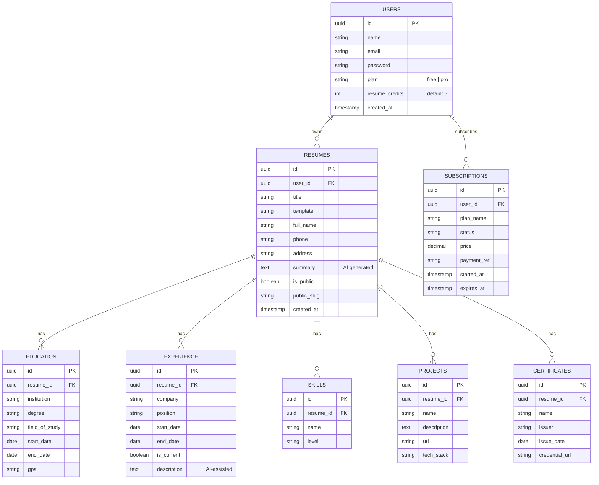

# ERD — AI Resume Builder (v0.1)

GitHub otomatis merender diagram mermaid di bawah ini.

## Business logic notes

- 1 kredit dipotong hanya saat `INSERT` baru ke tabel `resumes` (create), bukan `UPDATE`.
- Cek kredit sebaiknya dilakukan di service layer (`ResumeService::create()`), bukan di controller.
- Saat `subscriptions` status berubah jadi `active`, update `users.plan = 'pro'`.
- Cron job harian mengecek `subscriptions.expires_at` — jika lewat, `users.plan` kembali ke `free`.
